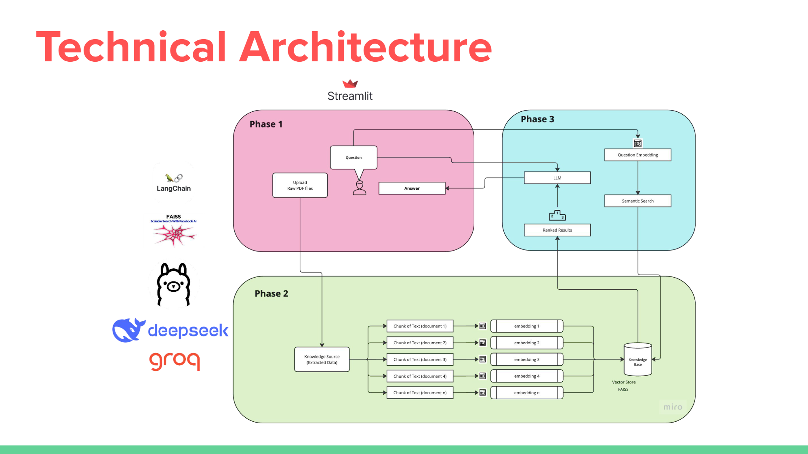
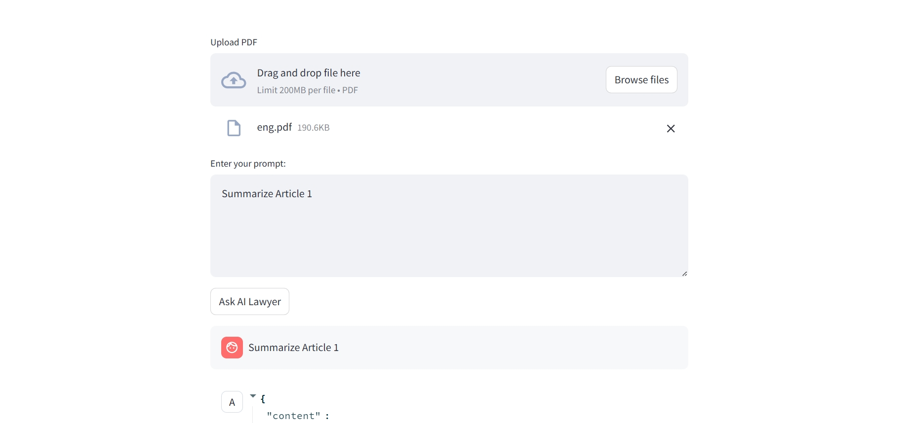

# LawyerDas (RAG) Application

## 📌 Project Overview
This project implements a **Retrieval-Augmented Generation (RAG) pipeline**, leveraging **DeepSeek R1, FAISS, Ollama, and Groq** to enhance language model responses with relevant document retrieval. Users can upload PDFs, and the chatbot will provide accurate answers based on retrieved document embeddings.

## ✨ Features
- 🎨 **Dynamic 3D UI** with an engaging interface.
- 📂 **PDF upload support** to process documents.
- ⚡ **Efficient vector search** using FAISS.
- 🧠 **DeepSeek R1 embeddings** for document indexing.
- 🤖 **Groq-powered LLM** for intelligent responses.
- 🔗 **Seamless retrieval and generation pipeline.**

## 🛠️ Tech Stack
- **Frontend**: Streamlit (Customized with a dynamic background)
- **Embeddings**: DeepSeek R1 (via Ollama)
- **Vector Database**: FAISS
- **LLM**: Groq
- **Backend**: Python

## 🚀 Installation Guide

### 1️⃣ Clone the Repository
```bash
git clone https://github.com/your-repo/rag-application.git
cd rag-application
```

### 2️⃣ Create a Virtual Environment
```bash
python -m venv venv
source venv/bin/activate  # On Windows: venv\Scripts\activate
```

### 3️⃣ Install Dependencies
```bash
pip install -r requirements.txt
```

### 4️⃣ Run the Application
```bash
streamlit run app.py
```

## 📖 Usage Guide
1. **Upload a PDF** via the Streamlit UI.
2. **Documents are processed and indexed** in FAISS.
3. **Ask questions**, and the chatbot retrieves relevant content.
4. **Groq generates responses** based on the retrieved context.

## 🏗️ Architecture


## 📷 UI Interface


## 🔮 Future Enhancements
- **Support for multiple document formats.**
- **Integration with other vector databases (e.g., Pinecone).**
- **Fine-tuned LLM for domain-specific tasks.**
- **Web-based deployment for wider accessibility.**
- **Enhanced UI with 3D symbols and dynamic visuals.**

## 🤝 Contributing
1. Fork the repository.
2. Create a new branch: `git checkout -b feature-branch`.
3. Commit changes and push: `git push origin feature-branch`.
4. Open a Pull Request.

## 📜 License
This project is licensed under the MIT License.

## 🙌 Acknowledgments
- **DeepSeek R1** for embeddings.
- **FAISS** for efficient document retrieval.
- **Groq** for powerful LLM capabilities.
- **Streamlit** for a user-friendly UI.
- **3D UI components** for an immersive experience.

